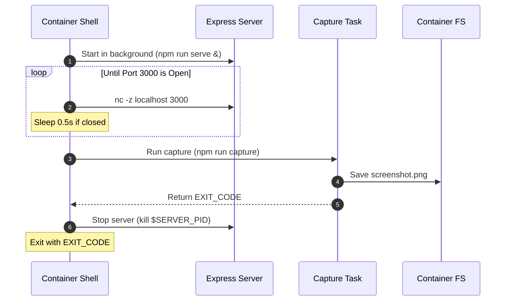

# docker-chromium-screenshot

Create a screenshot of a SPA using Playwright and Chromium in Docker.

Useful for creating dense info-graphics using web technologies.

## Building

```sh
docker buildx . \
    -t ghcr.io/s0cks/docker-chromium-screenshot:latest
```

## Running

```sh
docker run \
    -v $(pwd)/out:/out \
    ghcr.io/s0cks/docker-chromium-screenshot:latest
```

### Process


