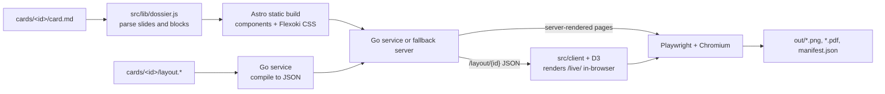

# docker-chromium-screenshot

Turn Markdown, JSON or jsonnet into dense, scannable infographic cards: high-fidelity PNGs (and PDFs) rendered by Chromium in Docker, built to run unattended as a GitHub Action or any other CI.

Each **card is one self-contained directory** — its content, its logo, its own colour tweaks, any extra metadata, all alongside each other — so a card can be copied, committed, or handed to another repo's CI as a single unit with one mount. Write it in Markdown with fenced blocks for stats, findings, timelines and charts, or as JSON/YAML/jsonnet rendered live by a small Go service and a browser-side SPA using D3. Either way, the run fails if a slide overflows its frame or carries too many words.


| | |
| --- | --- |
|  |  |

## Quick start

Render the bundled sample cards (two Markdown, one jsonnet):

```sh
docker run --rm -v "$PWD/out:/app/out" -e OUT_OWNER="$(id -u):$(id -g)" \
  ghcr.io/s0cks/docker-chromium-screenshot:latest --theme both
```

Render your own — the entire interface is one directory:

```sh
docker run --rm \
  -v "$PWD/cards:/app/cards:ro" -v "$PWD/out:/app/out" \
  -e OUT_OWNER="$(id -u):$(id -g)" \
  ghcr.io/s0cks/docker-chromium-screenshot:latest --theme both --pdf --strict
```

Or with Compose (see `docker-compose.yml`): `docker compose run render`.

Output: `out/<card>/<NN>.<theme>.png` (3200x2000 at the default scale of 2), optional `<card>.<theme>.pdf`, and `out/manifest.json` listing every file and problem.

New to this? [docs/build-a-card.md](docs/build-a-card.md) walks through building one card, step by step, in Markdown, JSON, YAML and jsonnet.

### The one mount: `cards/`

```
cards/
  _shared/                # optional: shared across every card below
    dossier.libsonnet       # jsonnet helper library
    theme.css                # repo-wide colour overrides
    meta.json                 # extra metadata merged into every card
  documents-show/          # a card — one directory, fully self-contained
    card.md                  # Markdown dossier ...
    logo.png                  # ... its own logo, auto-detected, no config
    theme.css                  # ... and its own colour override, if wanted
  ops-review/
    layout.jsonnet            # or a JSON/YAML/jsonnet card instead of Markdown
    meta.json                  # its own extra metadata
```

That's the whole interface — one read-only volume, `CARDS_DIR` (default `cards`). Nothing else needs mounting.

### Options

| Flag | Default | Meaning |
| --- | --- | --- |
| `--theme` | `auto` | `light`, `dark`, `both`, or `auto` (each card's own theme) |
| `--scale` | `2` | Device scale factor |
| `--pdf` | off | One PDF per card and theme, one page per slide (Markdown cards only) |
| `--strict` | off | Exit 1 on overflow, missing fonts or word-budget warnings |
| `--out` | `out` | Output directory (`$OUT_DIR`) |
| `--skip-build` | off | Reuse an existing `dist/` |
| `--no-live` | off | Skip capturing JSON/jsonnet cards |
| `<id> ...` | all | Only render these cards (by directory name, either kind) |

Environment: `CARDS_DIR`, `OUT_DIR`, `OUT_OWNER` (`uid:gid` for output files), `CHROMIUM_EXECUTABLE`, `SERVICE_BIN` (path to the Go binary; auto-detected at `service/bin/dossier-service`).

## In CI

GitHub Actions, using the composite action in this repo:

```yaml
- uses: actions/checkout@v4
- uses: s0cks/docker-chromium-screenshot@main
  with:
    cards: cards
    theme: both
    strict: "true"
- uses: actions/upload-artifact@v4
  with: { name: cards, path: out/ }
```

Any other CI: run one of the `docker run` commands above. `--strict` gives a non-zero exit code when a slide needs editing, so a bad card fails the pipeline instead of publishing a clipped image.

## Writing a card

Full walkthrough: [docs/build-a-card.md](docs/build-a-card.md). Reference for every block and the JSON/jsonnet schema: [docs/authoring.md](docs/authoring.md). In short, a Markdown card is `cards/<id>/card.md`:

````md
---
series: The Documents Show
subject: Leon Black
part: Day 2 of 2
handle: u/Sudden_Leg_2184
theme: light          # light | dark
accent: purple        # any Flexoki hue; purple (pu/pu2) is the house default
size: 1600x1000       # or landscape, wide, og, square, portrait, story
---

## Where It Stands

Lead paragraph. Everything before `+++` goes in the left column.

```callout tone=accent mono
Blocks are fenced. This one is Markdown inside.
```

+++

### The Ledger

```stats cols=2
- { value: $158M, label: Paid to Epstein, note: 2012–2017, tone: ink }
- { value: $0, label: Criminal charges filed }
```

---

## Next slide
````

- `---` starts a new slide, `+++` splits the lead and main columns, the first `#` or `##` is the slide title, and `###` is a section heading.
- Blocks: `callout`, `quote`, `stats`, `findings`, `threads`, `timeline` (vertical or horizontal, D3-positioned), `chart` (bar, line, area, hbar, donut — all D3), `profile`, `sources`, `qr`. Tables are plain GFM.
- `@include name` reuses a snippet defined under `snippets:` in the frontmatter.
- A `logo.{png,jpg,svg,webp}` next to `card.md` shows up in the masthead automatically; a `theme.css` next to it restyles that card alone.

Samples: [cards/documents-show](cards/documents-show) (a recreation of the original carding format, with its logo), [cards/showcase](cards/showcase) (every component), [cards/ops-review](cards/ops-review) (the same content model, written in jsonnet, with its own blue `theme.css`).

## JSON and jsonnet cards

The same slide/block model is also servable straight from data — useful when another system (or a person who'd rather write jsonnet) is producing the card. Drop a `layout.json`, `layout.yaml` or `layout.jsonnet` in `cards/<id>/` instead of `card.md`; it's compiled on request by the Go service (`GET /layout/<id>`) and rendered client-side at `/live/?dossier=<id>&slide=<n>`, using [D3](https://d3js.org) for the charts and timelines. `cards/_shared/dossier.libsonnet` is a small helper library for building the block JSON by hand. `render.mjs` captures these the same way it captures Markdown cards, in the same run.

See [docs/build-a-card.md](docs/build-a-card.md) for a step-by-step build in all three formats, and [docs/authoring.md#json-and-jsonnet-cards](docs/authoring.md#json-and-jsonnet-cards) for the schema and current client-renderer coverage.

## The Go service

`service/` is a small Go binary (replacing what used to be a Node `server/` package) that serves the built SPA plus:

- `GET /meta` and `GET /meta/{id}` — version, commit, branch and build time (baked in via `-ldflags`, overridable by env), a sha256 hash per file under `CARDS_DIR` plus a combined Merkle-style root, and `cards/_shared/meta.*` merged with (and, per key, overridden by) that card's own `meta.json`/`meta.yaml`/`meta.jsonnet`.
- `GET /layout/{id}` and `GET /layouts` — compiles a card's `layout.json`/`.yaml`/`.jsonnet` (importing from the card's own directory and `cards/_shared/`), injecting its `logo.*` automatically if the layout didn't set one.
- `/cards/*` — the whole `CARDS_DIR`, served as static files (a card's logo, theme.css, anything else it carries).
- Index-fallback static serving for the SPA, and an optional `/` redirect (`INDEX_REDIRECT`) — the one thing the old Node service existed to do.

`render.mjs` spawns this binary automatically (`SERVICE_BIN`, or `service/bin/dossier-service`) to serve captures; without it, a minimal built-in server still serves Markdown cards and `/cards/*`, but JSON/jsonnet cards have nothing to compile them, so they're skipped.

```sh
cd service
go build -o bin/dossier-service ./cmd/dossier-service   # or: npm run build:service
go test ./...
DIST_DIR=../dist CARDS_DIR=../cards ./bin/dossier-service
```

Its two small dependencies (`go-jsonnet`, `sigs.k8s.io/yaml`) are vendored locally rather than fetched — see [service/vendor-src/README.md](service/vendor-src/README.md) for why and how to re-vendor a newer version.

## House style

Flexoki light and dark. The house accent is Flexoki purple — `pu` (the deep, 600 step) for solid fills and text, `pu2` (the bright, 400 step) for a second, lighter touch (the kicker bar's gradient, the pager number) — with every other hue carrying the same `<hue>` / `<hue>-2` pair if a card sets `accent:` to something else. Type is Newsreader for headlines, IBM Plex Sans for reading and IBM Plex Mono for labels and sources, all bundled so renders are byte-stable offline. Colour carries meaning (red adverse, green confirmed, yellow alleged, orange/purple open); see [docs/brand.md](docs/brand.md). A card's own `theme.css`, or `cards/_shared/theme.css` for every card at once, restyles any of this with no rebuild.

## Local development

```sh
npm ci
npm run build:service       # builds service/bin/dossier-service (needs Go 1.22+)
npm run dev                 # http://localhost:4321, reloads when a card changes
npm test                    # parser and chart/timeline unit tests (Node)
cd service && go test ./... # Go unit + HTTP integration tests
npx playwright install chromium
npm run render -- --theme both --strict     # SERVICE_BIN auto-detected once built
npm run samples              # refresh docs/samples
```

Requires Node 22+ and, for the service, Go 1.22+. The `playwright` version in `package.json` must equal `PLAYWRIGHT_VERSION` in the `Dockerfile`; the image build checks it.

## How it works


```mermaid
flowchart LR
    MD["cards/&lt;id&gt;/card.md"] --> P[src/lib/dossier.js<br/>parse slides and blocks]
    J["cards/&lt;id&gt;/layout.*"] --> G[Go service<br/>compile to JSON]
    P --> A[Astro static build<br/>components + Flexoki CSS]
    A --> S[Go service or fallback server]
    G --> S
    S -->|server-rendered pages| C[Playwright + Chromium]
    S -->|"/layout/{id} JSON"| L[src/client + D3<br/>renders /live/ in-browser]
    L --> C
    C --> O[out/*.png, *.pdf, manifest.json]
```

Layout: `src/lib` parser and chart/timeline maths (shared by server and client), `src/components` Astro chrome and blocks, `src/client` the D3-based live renderer, `src/styles` tokens and CSS, `service` the Go binary, `scripts/render.mjs` the capture CLI, `cards` every card.

## License

See [LICENSE](LICENSE).
